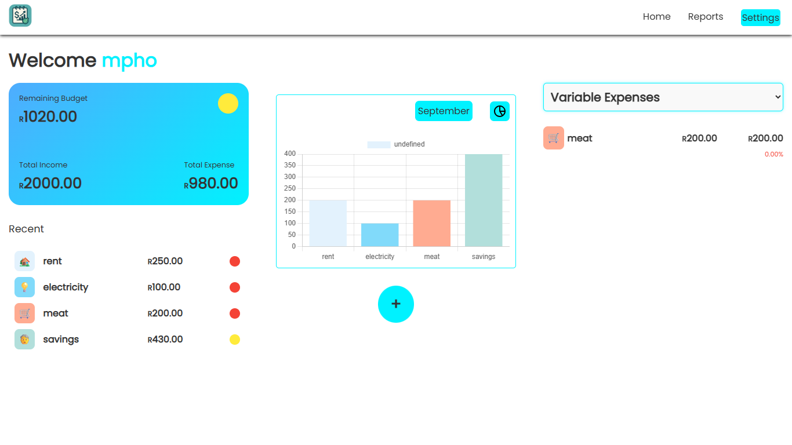
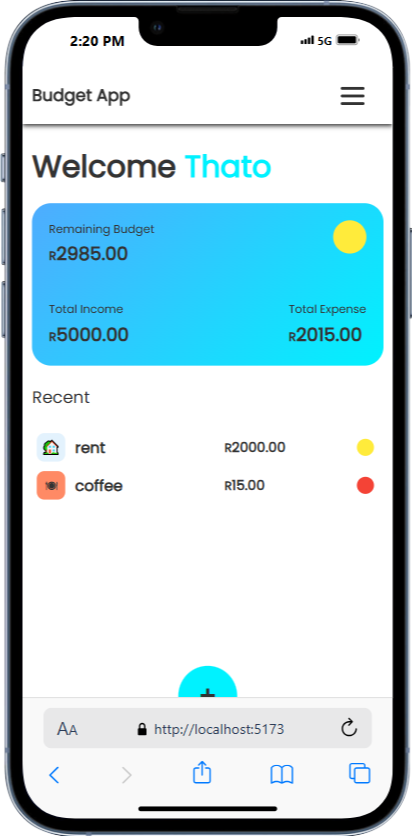

# Expensify

A modern, full-stack budgeting application to help you track expenses, manage categories, and visualize your financial health. Built with a React + Vite + Sass frontend and a Node.js + Express + MongoDB backend.

---

## Table of Contents
- [Features](#features)
- [Project Structure](#project-structure)
- [Screenshots & Designs](#screenshots--designs)
- [Getting Started](#getting-started)
- [API Endpoints](#api-endpoints)
- [Contributing](#contributing)
- [License](#license)

---

## Features
- User authentication and management
- Add, update, and delete transactions
- Categorize expenses (fixed, variable, savings, investments, emergencies, debts, givings)
- Set spending limits and track progress
- Visual reports and charts
- Responsive design for desktop and mobile
- Fun budget tips and motivational quotes

---

## Project Structure

```
project/
│
├── backend/           # Node.js + Express API
│   ├── models/        # Mongoose models (user, transaction, log, etc.)
│   ├── routes/        # API route handlers
│   ├── server.js      # Main server entry point
│   └── package.json   # Backend dependencies
│
├── frontend/          # React + Vite + Tailwind client
│   ├── src/
│   │   ├── components/    # UI components (Dashboard, Modals, Reports, etc.)
│   │   ├── data/          # Example data and tips
│   │   ├── reusable/      # Reusable UI elements
│   │   ├── styles/        # SCSS and Tailwind configs
│   │   └── utils/         # API helpers, chart configs
│   ├── designs/           # Figma/PNG design references
│   ├── index.html         # App entry
│   └── package.json       # Frontend dependencies
│
└── README.md          # Project documentation
```

---

## Screenshots & Designs
- Desktop and mobile designs are available in `frontend/designs/`
- Example mobile modal:
  

### Dashboard Screenshots

#### Desktop
[

#### Mobile
[

---

## Getting Started

### Prerequisites
- Node.js (v18+ recommended)
- npm or yarn
- MongoDB (local or Atlas)

### Backend Setup
```bash
cd backend
npm install
# Create a .env file for MongoDB URI and secrets
npm start
```

### Frontend Setup
```bash
cd frontend
npm install
npm run dev
```

### Environment Variables
- Backend: Create a `.env` file in `/backend` with:
  - `MONGODB_URI=your_mongodb_connection_string`
  - `JWT_SECRET=your_jwt_secret`

---

## API Endpoints
- `POST /user/register` — Register a new user
- `POST /user/login` — Login and receive JWT
- `GET /transactions` — Get all transactions for user
- `POST /transactions` — Add a new transaction
- `PUT /transactions/:id` — Update a transaction
- `DELETE /transactions/:id` — Delete a transaction
- ...and more (see `/backend/routes/`)

---

## Contributing
Pull requests are welcome! For major changes, please open an issue first to discuss what you would like to change.

---

## License
[MIT](LICENSE)
